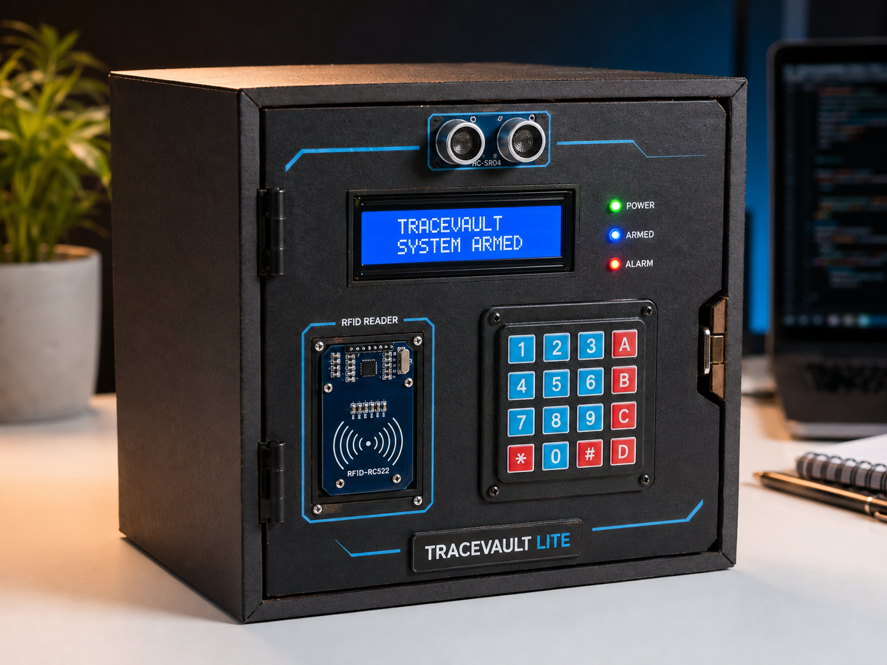
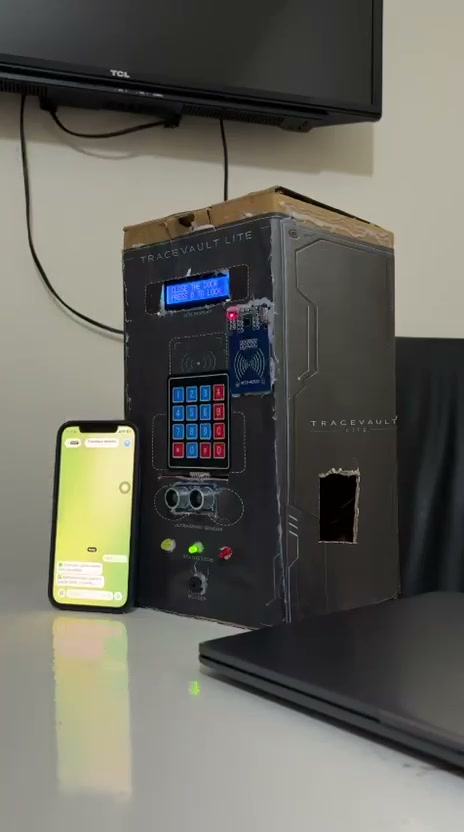
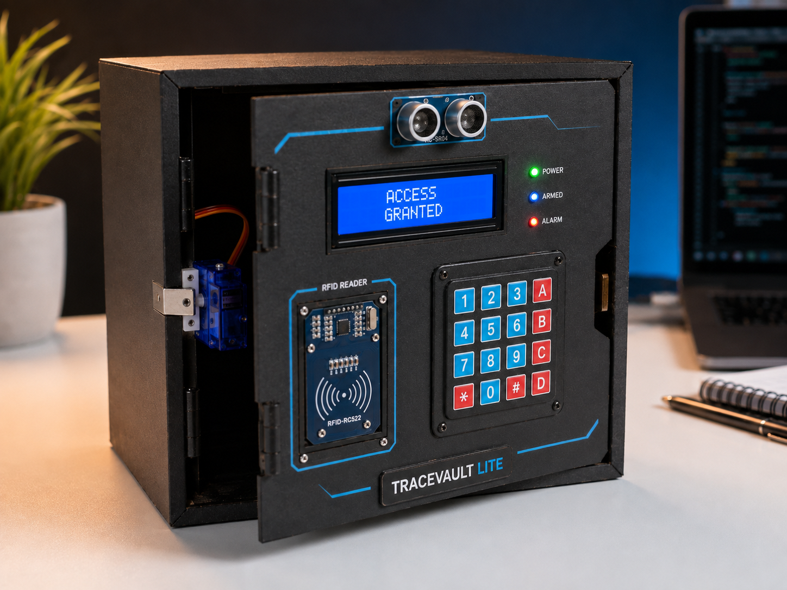
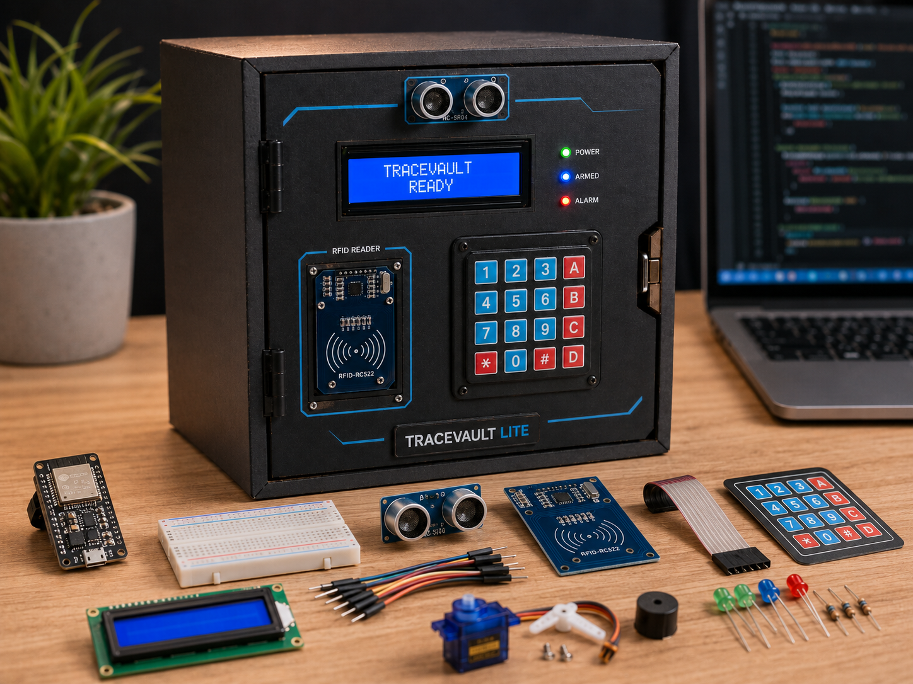
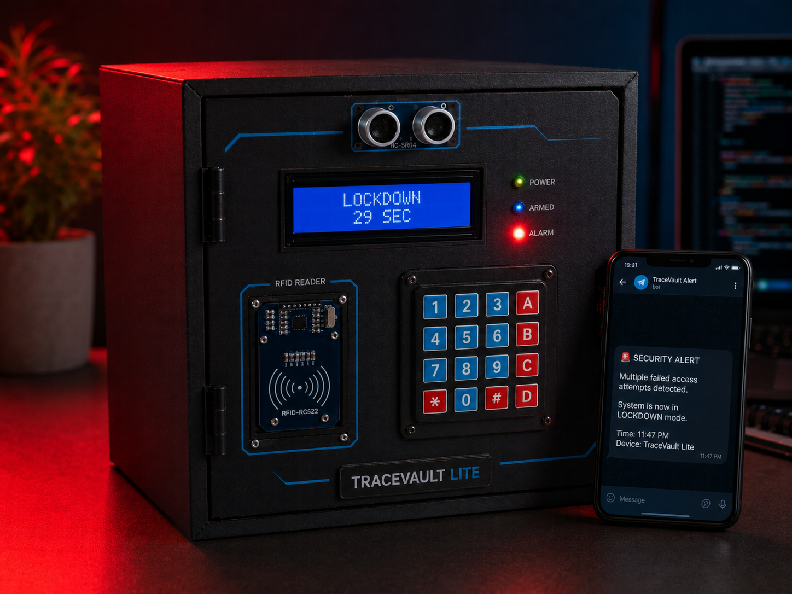

# TraceVault Lite – ESP32 IoT Smart Security Vault

TraceVault Lite is an ESP32-based smart security vault that brings together
embedded systems, robotics, two-factor access control, and IoT security alerts.
An HC-SR04 detects a nearby person, an RC522 card must pass local RFID
authentication, and a four-digit PIN must then be entered before an SG90 servo
releases the latch.

All access decisions happen locally on the ESP32. Wi-Fi, NTP, and Telegram are
used only for timestamped security notifications, so loss of connectivity does
not disable the physical RFID/PIN workflow.

<p align="center">
  
</p>

<p align="center">
  <strong>TraceVault Lite – ESP32 IoT Smart Security Vault</strong><br>
  <em>Project visualization / concept render</em>
</p>

## 🎥 Demo Video

Watch the complete TraceVault Lite authentication and security workflow in
action. Unlike the concept renders below, this is a real demonstration of the
physical project.

<p align="center">
  <a href="media/tracevault-demo.mp4">
    
  </a>
</p>

▶️ **[Watch the full TraceVault Lite demonstration](media/tracevault-demo.mp4)**

The real demonstration shows:

- Physical system armed and ready for authentication
- HC-SR04 proximity detection prompting the RFID workflow
- RFID card scanning followed by keypad PIN entry
- Successful authentication, green status feedback, and servo-controlled door opening
- Keypad relocking after access
- Repeated failed authentication attempts leading to the 30-second lockdown
- Red security indication and the LCD lockdown countdown
- TraceVault security notifications arriving in Telegram

## 📸 Project Visuals

The images below are polished project visualizations / concept renders. They
illustrate the intended TraceVault Lite design and operating states; they are
not presented as documentary photographs of the physical finished prototype.

<table>
  <tr>
    <td align="center" width="50%">
      <strong>1. TraceVault Lite</strong><br><br>
      <br>
      <em>TraceVault Lite – armed state</em><br>
      <sub>Project visualization / concept render</sub>
    </td>
    <td align="center" width="50%">
      <strong>2. Access Granted</strong><br><br>
      <br>
      <em>Successful RFID + PIN authentication and servo unlock</em><br>
      <sub>Project visualization / concept render</sub>
    </td>
  </tr>
  <tr>
    <td align="center" width="50%">
      <strong>3. Hardware Overview</strong><br><br>
      <br>
      <em>ESP32 and main hardware components used in TraceVault Lite</em><br>
      <sub>Project visualization / concept render</sub>
    </td>
    <td align="center" width="50%">
      <strong>4. Security Lockdown</strong><br><br>
      <br>
      <em>Security lockdown state after repeated failed authentication attempts</em><br>
      <sub>Project visualization / concept render</sub>
    </td>
  </tr>
</table>

## Features

- Local RFID + PIN authentication
- Ultrasonic presence detection within a configurable 60 cm threshold
- Servo-driven lock and unlock control
- 16×2 LCD, three status LEDs, and passive-buzzer feedback
- Combined failed-attempt counter for invalid RFID cards and incorrect PINs
- 30-second lockdown after three failed attempts
- Non-blocking lockdown countdown and alarm handling
- Telegram notifications for system, access, failure, lockdown, and relock events
- NTP-based timestamps configured for Beirut local time
- Manual 4×4 matrix-keypad scanning with pull-ups and software debouncing

## System workflow

```text
Person detected
      ↓
Scan RFID
      ↓
Authorized RFID?
      ↓ yes
Enter PIN, then press #
      ↓
Correct PIN?
      ↓ yes
Servo unlocks
      ↓
Access granted
      ↓
Press D to lock again
```

Failure path:

```text
Wrong RFID or PIN
      ↓
Failed attempt
      ↓
3 failed attempts
      ↓
30-second lockdown
      ↓
Door locked + red LED + buzzer alarm
      ↓
LCD countdown + Telegram alert
```

Attempts from RFID and PIN failures count toward the same three-attempt limit.
During PIN entry, `*` clears the entered digits, `#` submits the PIN, and `D`
cancels the scan. After access is granted, `D` locks the vault again.

## Hardware

- ESP32 DevKit V1 / ESP32-WROOM-32
- RC522 RFID reader and RFID card/tag
- 4×4 matrix keypad
- HC-SR04 ultrasonic sensor
- SG90 micro servo
- 16×2 LCD with I2C backpack at address `0x27`
- Passive, tone-capable buzzer
- Yellow, green, and red LEDs
- Four 10 kΩ keypad pull-up resistors
- 1 kΩ and 2 kΩ resistors for the HC-SR04 ECHO voltage divider
- Current-limiting resistors for the LEDs
- Breadboard and jumper wires

## GPIO mapping

This table is generated from the constants in the current
[`TraceVault_Lite.ino`](TraceVault_Lite.ino) source.

| Subsystem | Signal | ESP32 GPIO | Wiring note |
|---|---|---:|---|
| RC522 | SCK | 18 | SPI clock |
| RC522 | MOSI | 23 | SPI controller output |
| RC522 | MISO | 19 | SPI controller input |
| RC522 | SDA / SS | 5 | SPI chip select; this is not I2C SDA |
| RC522 | RST | 27 | Reset |
| I2C LCD | SDA | 21 | I2C data |
| I2C LCD | SCL | 22 | I2C clock |
| SG90 servo | Signal | 25 | 50 Hz servo control |
| HC-SR04 | TRIG | 26 | ESP32 output |
| HC-SR04 | ECHO | 39 | Input only; use the documented voltage divider |
| Passive buzzer | Signal | 33 | LEDC channel 6 |
| Yellow LED | Anode signal | 12 | Armed / ready state |
| Green LED | Anode signal | 4 | Access granted / unlocked |
| Red LED | Anode signal | 15 | Denial / lockdown |
| Keypad pin 1 | Drive line 1 | 13 | Output |
| Keypad pin 2 | Drive line 2 | 14 | Output |
| Keypad pin 3 | Drive line 3 | 16 | Output |
| Keypad pin 4 | Drive line 4 | 17 | Output |
| Keypad pin 5 | Read line 1 | 32 | Input with external 10 kΩ pull-up to 3.3 V |
| Keypad pin 6 | Read line 2 | 34 | Input only; external 10 kΩ pull-up to 3.3 V |
| Keypad pin 7 | Read line 3 | 35 | Input only; external 10 kΩ pull-up to 3.3 V |
| Keypad pin 8 | Read line 4 | 36 / VP | Input only; external 10 kΩ pull-up to 3.3 V |

The keypad scanner drives only GPIO 13, 14, 16, and 17. GPIO 32, 34, 35,
and 36 remain inputs, with one 10 kΩ pull-up from each read line to 3.3 V.

Connect HC-SR04 ECHO through a 1 kΩ / 2 kΩ divider: ECHO to 1 kΩ, the
resistor junction to GPIO 39, and 2 kΩ from the junction to ground. This reduces
the sensor's 5 V ECHO signal to approximately 3.3 V.

### Power and grounding

- Power the RC522 from 3.3 V; do not apply 5 V to it.
- Power the HC-SR04 from 5 V and protect ECHO with the divider above.
- Power the SG90 from a stable 5 V supply sized for its current demand. Avoid
  powering the servo from the ESP32 3.3 V pin.
- Check the voltage and I2C pull-ups used by the specific LCD backpack before
  connecting it to the ESP32's 3.3 V logic.
- Use a current-limiting resistor for every LED.
- Tie the ESP32, sensors, servo supply, LCD, LEDs, and buzzer to a common ground.

See [`docs/SETUP.md`](docs/SETUP.md) for configuration, dependencies, and upload
instructions.

## Software design

| Function | Responsibility |
|---|---|
| `setup()` | Initializes LEDs, keypad I/O, servo lock position, LEDC buzzer, ultrasonic sensor, I2C LCD, SPI RFID reader, and Wi-Fi. |
| `loop()` | Services deferred servo detach, runs the state dispatcher, and yields briefly. |
| `runFullSystem()` | Maintains Wi-Fi and routes execution to lockdown, unlocked-door, PIN-entry, or proximity/RFID handling. |
| `readDistanceCm()` | Sends the HC-SR04 trigger pulse, measures ECHO with a timeout, and converts flight time to centimeters. |
| `readRFID()` | Detects a new card, copies its UID, applies scan timing control, and safely ends the RC522 transaction. |
| `checkRFID()` | Compares the scanned UID length and bytes with the configured authorized UID. |
| `readKeypad()` | Debounces the manually scanned matrix and reports a held key only once until release. |
| `handlePinEntry()` | Accepts digits, clear, submit, and cancel keys; grants access only when the configured PIN matches. |
| `handleRFIDScanning()` | Animates a scan, accepts the configured UID, enters PIN mode, or records a failed attempt. |
| `handleProximity()` | Samples distance every 250 ms and prompts for RFID when a person enters the detection range. |
| `moveServoFast()` | Attaches the servo, immediately commands the target angle, and schedules a later detach. |
| `registerFailedAttempt()` | Locks the authentication state, increments the shared counter, provides denial feedback, and sends warnings for attempts one and two. |
| `startLockdown()` | Forces the locked state, starts the solid red indicator, LCD countdown, alternating alarm, and a background Telegram task. |
| `handleLockdown()` | Updates the alarm and countdown without blocking the main loop, then resets the system after 30 seconds. |
| `sendTelegramAlert()` | Builds an event-specific message with an NTP timestamp and sends it through the Telegram bot API when Wi-Fi is available. |

## Technologies used

- ESP32 and Embedded C++ with the Arduino framework
- SPI communication for the MFRC522 RFID reader
- I2C communication for the 16×2 LCD
- Matrix keypad scanning and software debouncing
- PWM-style servo control through ESP32Servo
- Ultrasonic time-of-flight distance measurement
- ESP32 LEDC tone generation for buzzer feedback
- Wi-Fi and HTTPS-based Telegram Bot API notifications
- NTP time synchronization and timezone-aware event timestamps
- FreeRTOS task execution for the lockdown alert

## Getting started

1. Copy `secrets.example.h` to `secrets.h`.
2. Add your Wi-Fi, Telegram, four-digit PIN, and authorized RFID UID values to
   `secrets.h`. That file is ignored by Git.
3. Install the ESP32 board package and the libraries listed in
   [`docs/SETUP.md`](docs/SETUP.md).
4. Verify the wiring and common ground before applying power.
5. Compile and upload `TraceVault_Lite.ino` for an ESP32 Dev Module.

The committed source uses harmless placeholders and a demo PIN/UID when
`secrets.h` is absent, so it remains compilable without exposing credentials.

## Security notes

- RFID + PIN verification is local; Telegram availability never grants access.
- Never commit `secrets.h`, `.env`, a real PIN, or an authorized RFID UID.
- The firmware currently uses `WiFiClientSecure::setInsecure()`, so transport is
  encrypted but the server certificate is not validated. See
  [`docs/SECURITY.md`](docs/SECURITY.md) before adapting the prototype for a
  production security system.
- RC522 UID comparison is appropriate for a learning prototype but is not
  equivalent to cryptographic card authentication.

## Optional alert-server prototype

[`tools/alert_server.py`](tools/alert_server.py) is preserved from the working
files as an optional Flask/CSV experiment. The current firmware does not call
it; current alerts go directly from the ESP32 to Telegram. Its dependencies are
listed in [`tools/requirements.txt`](tools/requirements.txt).

## Demo

The real physical-project demonstration is featured in the
[Demo Video](#-demo-video) section above. The four Project Visuals remain
clearly labeled concept renders.

## What I learned

This project provided practical experience with ESP32 GPIO planning, hardware
wiring, SPI, I2C, RFID authentication, keypad matrix scanning and debouncing,
servo control, ultrasonic distance measurement, buzzer tone generation, Wi-Fi
integration, Telegram notifications, and hardware/software debugging. Most
importantly, it demonstrated how to combine multiple modules into one coherent
embedded system while keeping physical access decisions independent of network
availability.

## License

Released under the [MIT License](LICENSE).
